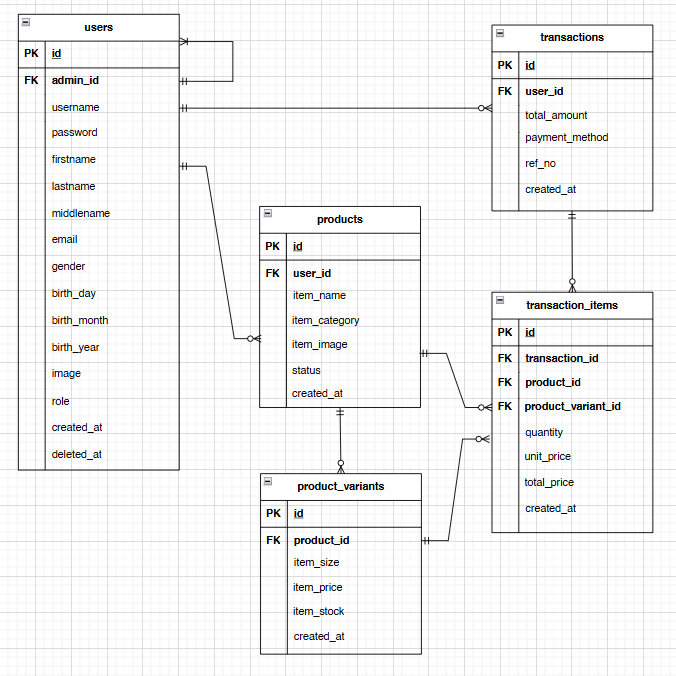
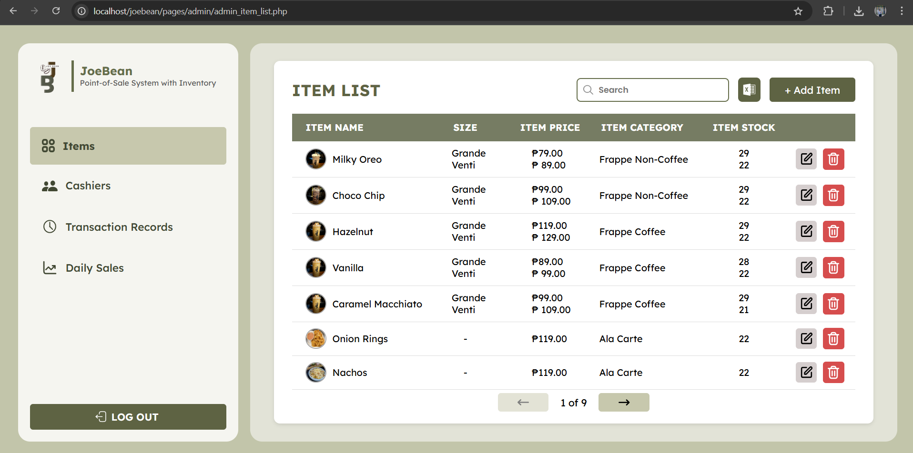
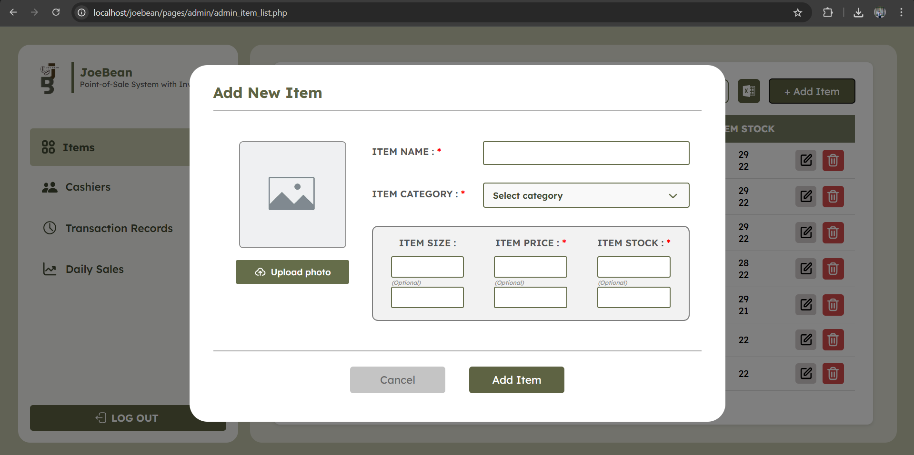
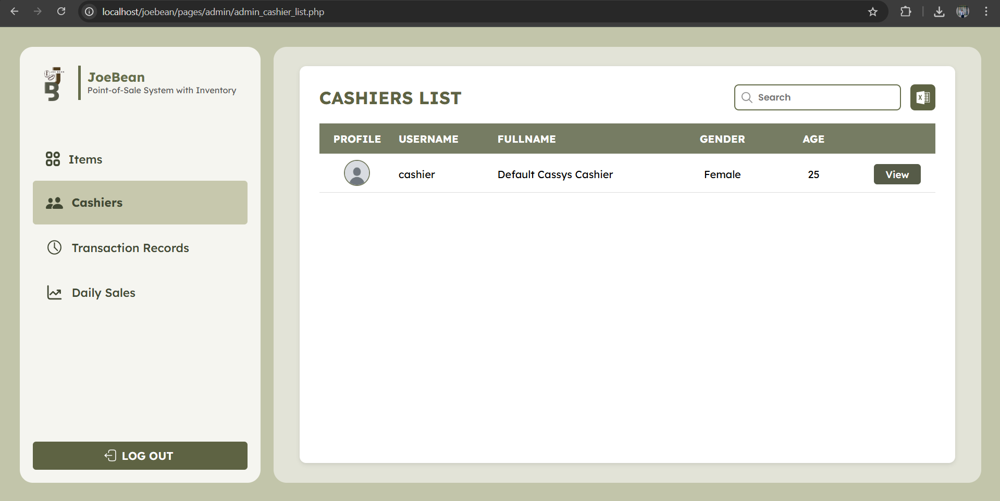
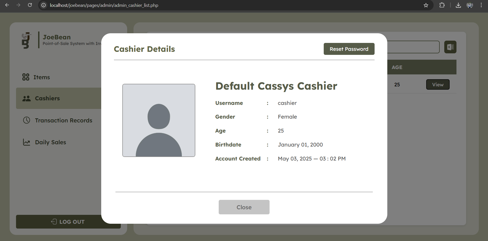
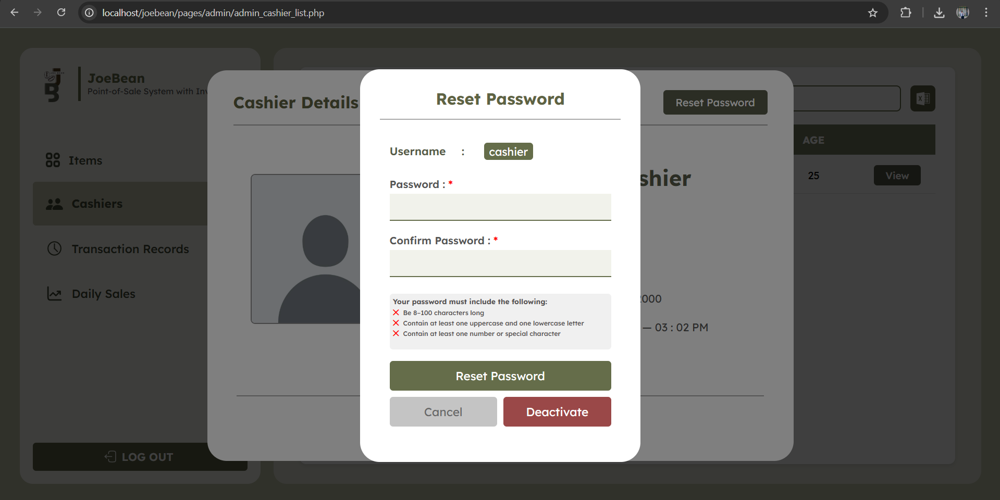
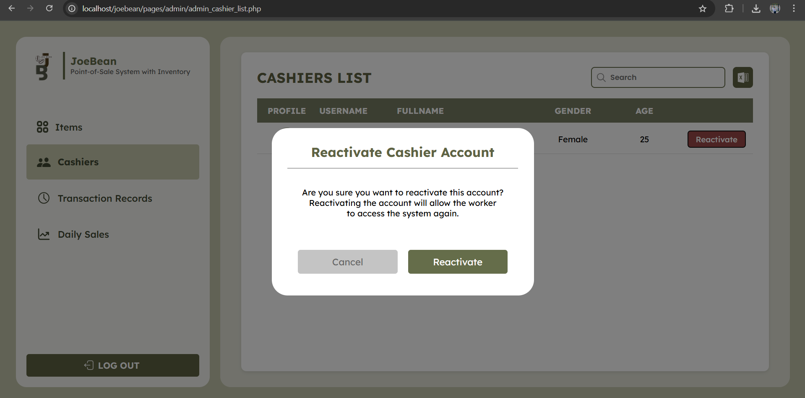
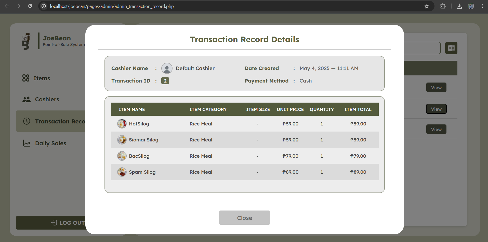
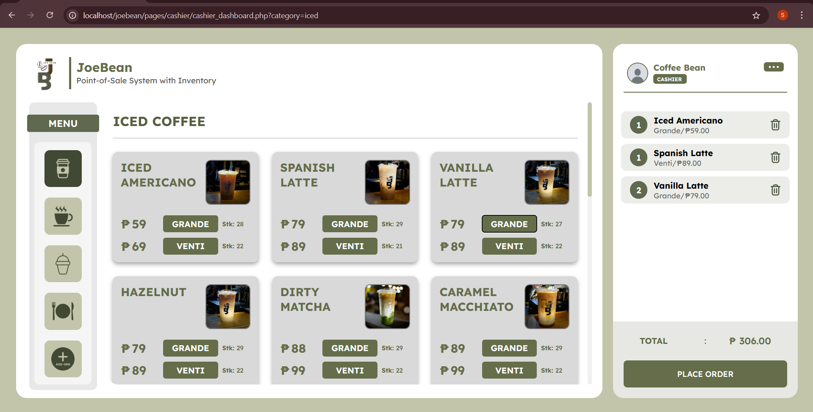

# ☕︎ Joebean : A Point-of-Sale System with Inventory
**Joebean** is a simple and efficient POS and inventory system designed for cafés and food businesses, featuring two main roles—**Admin** and **Cashier**—where Admins can manage items, transactions, and staff, while Cashiers can easily take and process customer orders.

## ✨ Features
  ### Joebean supports two user roles:
 #### 👤 Admin
   - Full access to Item Lists
   - Can manage cashier accounts
   - Can view transaction records

#### 👨‍💼 Cashier
  - Can view and select food & beverage items
  - Can place and process customer orders
  - Can view their own profile information

## </> Tech Stack
  - `HTML`
  - `CSS`
  - `JS (JavaScript)`
  - `PHP`
  - `MySQL`
 
## 💡 Get Started
### 1️⃣ Clone the Repository
```bash
https://github.com/clmnshn28/jeobean.git
cd jeobean
```
### 2️⃣ Set up your Database

Import the SQL file provided (if any) or create a new database:

```sql
CREATE DATABASE joebean;
```
Then, create the necessary tables based on the `ERD (Entity Relationship Diagram)` below:

**💡 The ERD illustrates how tables like `admins`, `cashiers`, `products`, and `transactions` are related.**

After that, update your database credentials in the config file:
 - Open `config/db.php`
 - If there is a custom port like `3307`, remove it to use the default MySQL port.
  
**From:**
```sql
$conn = new mysqli("localhost", "root", "", "joebean", 3307);
```
**To:**
```sql
$conn = new mysqli("localhost", "root", "", "joebean");
```

### 3️⃣ Launch Locally

If you're using XAMPP, MAMP, or any local server:

1. Move the project folder to the htdocs directory (or your server's root folder)
2. Start Apache and MySQL
3. Visit `http://localhost/joebean` in your browser
## 🔎 Overview

### 👤 Admin Screens

#### Admin Login


#### Admin Item List


#### Admin Item List Modals



#### Admin Cashier List


#### Admin Cashier List Modals





#### Admin Transaction Records




---

### 👨‍💼 Cashier Screens

#### Cashier Registration


#### Cashier Login


#### Cashier Dashboard


#### Cashier Dashboard Modals


## 💡 Let's build something useful together! 🚀

